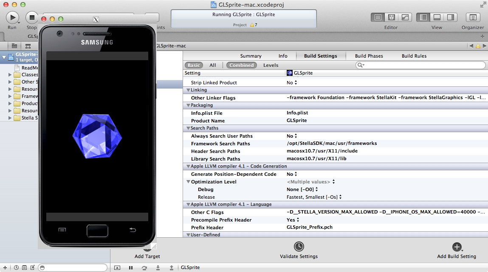

## Getting started with Stella SDK

### About Stella SDK

Stella SDK is an Objective-C based smartphone app development frameworks that allows existing skill sets to be reused for multiple smartphone platforms. It is comprised of the clang-based compiler tools and frameworks necessary for the app generation.

#### Stella SDK at a glance

Frameworks that comes with Stella SDK include:

* Foundation: OpenStep compliant Foundation framework
* OpenGLES: OpenGLES framework
* StellaGraphics: Quartz2D/CoreGraphics compatible framework
* StellaAnimation: QuartzCore/CoreAnimation compatible framework
* StellaKit: UIKit compatible framework (without user interface elements)
* StellaStore: StoreKit compatible framework and commercialisation APIs(Amazon IAP, Tapjoy etc)
* StellaMedia: Stella frameworks for audio and video processing
* cocos2d-iphone 1.1/2.0 (a popular iOS game engine written in Objective-C)

### Installing Stella SDK

Stella SDK can be cloned and installed from github. Get the installer from github:

    $ cd /opt
    $ git clone https://github.com/morningtec/StellaSDK.git
    $ /opt/StellaSDK/bin/stella-config --install

You need to restart Xcode and Terminal after the installation. Update Stella SDK for the first time and then periodically afterwards. Suppose the latest release is r2.2:

    $ cd /opt/StellaSDK
    $ git reset --hard origin/r2.2
    $ /opt/StellaSDK/bin/stella-config --install

### Porting iOS OpenGLES app GLSprite to Android

GLSprite is a sample Apple iOS app which demonstrates how to use OpenGLES. Using sibtool and xcgen, it can be ported to Android instantly.

#### Running GLSprite in Stella Android simulator

iOS developers use Xcode to develop apps on Macs. Stella SDK allows developers to use the same Xcode tool to develop for Android. Xcode projects contain organised information on source codes, resources, and settings required to build the apps. Creating separate Xcode projects targeting different platforms (e.g. iOS and Android) is usually considered best practice to source control and management.

Stella SDK comes with a tool called xcgen to generate Stella Xcode projects. Using xcgen, iOS Xcode projects can be automatically converted to ones that target either the Stella Android Simulator on Mac or real Android devices.

Using the iOS app demo GLSprite as an example, a separate Xcode project targeting the Android Simulator can be generated in the same folder as the iOS Xcode project:

    $ cd /opt/StellaSDK/samples/GLSprite
    $ xcgen --project GLSprite --target mac --es1

By default, Stella SDK is in OpenGLESv2 mode. GLSprite uses OpenGLESv1 hence Stella SDK needs to be reconfigured:

    $ stella-config --switch=es1

Note that Xib files need to be converted to sib files before they can be used in Stella Xcode projects.

    $ cd /opt/StellaSDK/samples/GLSprite/en.lproj
    $ sibtool -x MainWindow.xib

Now open the newly generated xcode project, and hit Run. The Stella Android simulator will be launched:

    $ open /opt/StellaSDK/samples/GLSprite/GLSprite-mac.xcodeproj

#### Getting GLSprite to run on Android devices

Having GLSprite running in Stella Android simulator is one step away from getting the same programme running in Android devices. Using xcgen again, this time targeting Android devices:

    $ cd /opt/StellaSDK/samples/GLSprite
    $ xcgen --project GLSprite --target android --es1

A GLSprite-android folder is created along with the xcode project. The structure is as follows:

    GLSprite-android/AndroidManifest.xml
    GLSprite-android/jni/Android.mk
    GLSprite-android/libs/stellasdk2.jar
    GLSprite-android/res/drawable/icon_android.png
    GLSprite-android/res/values/strings.xml
    GLSprite-android/src/com/yourcompany/glsprite/MainHActivity.java

Now open the xcode project and hit Build:

    $ open /opt/StellaSDK/samples/GLSprite/GLSprite-android.xcodeproj

Run the fix_assets.sh scripte to fix multilanguage issue.

    $ cd /opt/StellaSDK/samples/GLSprite/GLSprite-android
    $ stella-config --fix-assets

Plug in your Android device, the apk file can then be generated inside GLSprite-android folder:

    $ cd /opt/StellaSDK/samples/GLSprite/GLSprite-android
    $ android update project -p . -s -t android-10 -n GLSprite
    $ ndk-build
    $ ant clean; ant debug install

Please note that Google’s Android Virtual Devices (AVDs) are not supported as targets to install app made using Stella SDK. Real devices are required for testing and deployment of apps.

You should now be able to launch GLSprite on your Android device!

### Adapting your source code for Stella SDK

Following the above instruction, you can now generate a Stella SDK Xcode project for you app. To adapt the source codes for use with Stella SDK, however, you will find some minor tweakings necessarys.

#### Code changes due to class names

Stella SDK header files and class names are intentionally renamed from the compatible UIKit equivalents. This is to avoid conflicts with existing frameworks. For example, to use QuartzCore/CoreAnimation in Stella SDK, you will need to take care of both header imports as well as class names:

    #if defined (__STELLA_VERSION_MAX_ALLOWED)
    #import <StellaAnimation/StellaAnimation.h>
    #else
    #import <QuartzCore/QuartzCore.h>
    #endif

Stella SDK defines compatibility macros in the header files so that classes can be used just as documented:

    // Stella SDK compatibility macros defined in SAESGLLayer.h:
    #define CAEAGLLayer         SAESGLLayer

    // To use the class
    CAEAGLLayer *eaglLayer = (CAEAGLLayer*) self.layer;

class names Stella SDK follows the pattern:

Framework                     | Apple prefix   | Stella SDK prefix
-                             | -              | -
Foundation                    | NS             | NS
CoreGraphics/StellaGraphics   | CG             | SG
CoreAnimation/StellaAnimation | CA             | SA
UIKit/StellaKit               | UI             | UI
StoreKit/StellaStore          | SK             | SS
AVFoundation/StellaMedia      | AV             | AV

Under normal circumstances, Stella SDK’s compatibility layer will cause the compiler to replace the Standard prefixes to Stella SDK prefixes automatically and no more code change is necessary.

When prefix automatic replacement is deliberately not used, such as the CADisplayLink class in the GLSprite demo, manual replacement is required:

    #if defined (__STELLA_VERSION_MAX_ALLOWED)
    displayLink = [NSClassFromString(@"SADisplayLink") displayLinkWithTarget:self selector:@selector(drawView)];
    #else
    displayLink = [NSClassFromString(@"CADisplayLink") displayLinkWithTarget:self selector:@selector(drawView)];
    #endif

#### Code changes due to OpenGLES

For OpenGL renderbuffer objects that intend to have a CALayer backing, Stella implementation of glRenderBuffer functions (IMP) are required to replace the OpenGLES counterparts (OES).

    #if defined (__STELLA_VERSION_MAX_ALLOWED)
        glGenRenderbuffersIMP(1, &viewRenderbuffer);
    #else
        glGenRenderbuffersOES(1, &viewRenderbuffer);
    #endif

### Revision history

Revision    | Notes
-           | -
20120611    | Initial version
20120612    | Climber demo added
20120704    | Added Android APK generation for the demos
20120802    | Updated for xcgen with auto folder generation
20120805    | Minor updates and pedantic guides
20120815    | Minor corrections, updates on AVDs and nib support
20120917    | Minor corrections and update folder structure with latest xcgen
20130730    | Changes for Stella SDK II

