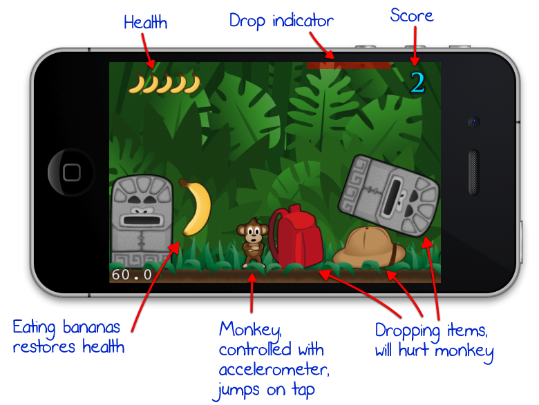
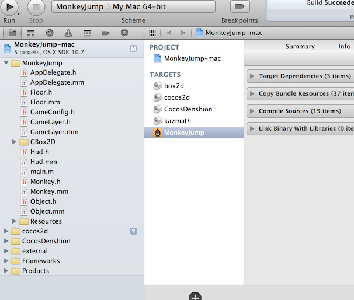
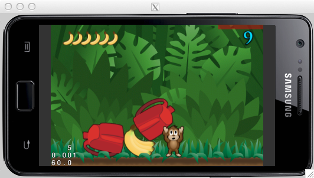
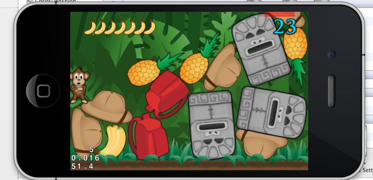
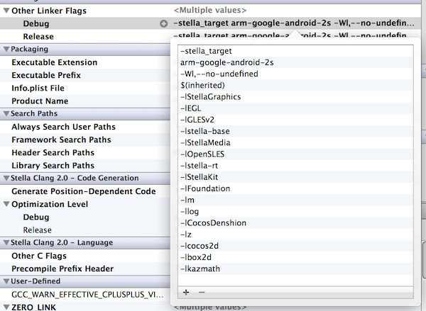

### Creating a MonkeyJump Game with Stella SDK

Prepared by Andreas Löw, the [MonkeyJump Game Demo][10] is part of Ray Wenderlich's iOS tutorial series. It is built using the following technologies:

 - Cocos2Dv2
 - Box2D/GBox2D
 - TexturePacker

The [origial source code][20] is designed for iOS only. This tutorial shows step by step how to develop such a game for both Android and iOS using Stella SDK.

[10]: http://www.raywenderlich.com/33525/how-to-build-a-monkey-jump-game-using-cocos2d-2-x-physicseditor-texturepacker-part-1

[20]: http://cdn1.raywenderlich.com/downloads/MonkeyJump2.zip

The game itself is designed around an accelerometer-controlled monkey. Dropping objects will hurt the monkey while eating bannas restores its health.

#### Project creation

A template Cocos2Dv2 project named MonkeyJump can be created using stella-config. We could convert the iOS Xcode project to Android simulator and start working with it:

    $ mkdir $HOME/Desktop/MonkeyJump
    $ cd $HOME/Desktop/MonkeyJump
    $ stella-config --setup-cocos2dv2-template=MonkeyJump

    $ stella-config --switch=es2
    $ xcgen --project MonkeyJump --target mac --es2
    $ open MonkeyJump-mac.xcodeproj 

#### Importing source codes

Copy the following folders from 7-Final/MonkeyJump/MonkeyJump to our project, and add relavant groups, files, and build phases in Xcode:

    MonkeyJump/*.h
    MonkeyJump/*.mm
    MonkeyJump/libs/Box2D
    MonkeyJump/GBox2D
    MonkeyJump/Resources

Remove obsolete files completely or in the build phase:

    tests/*.h
    tests/*.m
    ...

The template we created earlier contains a SceneTest target which we rename to MonkeyJump and use as a starting point. The product name needs to be changed to MonkeyJump.

Due to the fact that the background ccz is encrypted, make sure the Cocos2D ZipUtils module has caw_setkey_part () function. If not, update Ziputils.h and ZipUtils.h with the ones found in 7-Final/MonkeyJump/MonkeyJump/libs/cocos2d/Support:

	$ cd $HOME/Desktop/MonkeyJump
	$ cp <SOURCE>/7-Final/MonkeyJump/MonkeyJump/libs/cocos2d/Support/ZipUtils.* cocos2d/Support

Build settings for header/library/framework search paths needs to be modifed so that the game can be brought up in the Stella Android simulator. A complte MonkeyJump-mac xcode project can be found in the next section.

### Complete sample

A complete sample can be found at in Stella SDK:

    $ cd /opt/StellaSDK/samples/MonkeyJump

    $ stella-config --setup-cocos2dv2-template=MonkeyJump
    $ stella-config --switch=es2
    $ open MonkeyJump-mac.xcodeproj

After hitting Run, the game can be seen in the Stella Android simulator:

#### Backporting to iOS

We will use MonkeyJump-mac.xcodeproj to develop our game most of the time. To keep the iOS version up-to-date, we use xcgen again to backport from Android to iOS:

    $ cd /opt/StellaSDK/samples/MonkeyJump
    $ xcgen --backport mac --project MonkeyJump
    $ open MonkeyJump.xcodeproj

After hitting Run, the game is launched in iOS simulator:

#### Converting to Android

To generate the Andorid xcodeproj, we use xcgen again:

    $ cd /opt/StellaSDK/samples/MonkeyJump
    $ xcgen --project MonkeyJump --target android --es2
    $ open MonkeyJump-android.xcodeproj

Cocos2dV2 project should link kazmath library, add -lkazmath flag to the Other Linker Flags:

The file formats supported by CocosDenshion that comes with Stella SDK is as follows:

Platform			| Background Music	| Sound Effects
-					|-					|-
iOS					|	caf,wav,mp3	    | caf,wav
Android simulator	|	caf,wav,mp3	    | caf,wav
Android devices		|	wav,mp3,ogg	    | ogg,wav

We convert all the caf files cached in the assets to wav files:

	$ cd /opt/StellaSDK/samples/MonkeyJump/MonkeyJump-android/assets/Resources
	$ for i in *.caf; do afconvert -f WAVE -d LEI16@44100 -c 1 $i ${i%.caf}.wav; rm -f $i; done

As the game is landscape, we modify /opt/StellaSDK/samples/MonkeyJump/MonkeyJump-android/AndroidManifest.xml so that all the Android widgets are displayed correctly:

	<!-- AndroidManifest.xml -->	
	<activity android:name="MainHActivity"
	          android:label="@string/app_name"
	          android:screenOrientation="landscape"
	          android:configChanges="orientation|keyboardHidden">>
	    <intent-filter>
	        <action android:name="android.intent.action.MAIN" />
	        <category android:name="android.intent.category.LAUNCHER" />
	    </intent-filter>
	</activity>

We build the MonkeyJump-android project, and install the apk to the device (with a device connected):
	
	$ cd /opt/StellaSDK/samples/MonkeyJump/MonkeyJump-android 
	$ android update project -p . -s -t android-10
	$ ndk-build
	$ ant clean; ant debug install

### Revision history

Revision    | Notes
-           | -
20130916    | Initial revision

