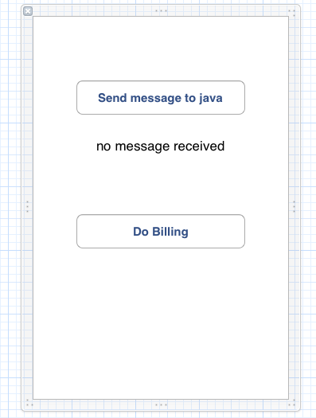

## Using Stella SDK Features

### At a glance

While Stella SDK is an Objective-C framework, Android development features many third-party APIs that are Java-based. Stella SDK Pro offers a JNIHelper class that provides a means of two-way communication between Objective-C and Java. This allows Objective-C developers to leverage third-party Java APIs in their apps quickly.

This tutorial demonstrates the concept of JNIHelper architecture and explains how to use JNIHelper with some of the built-in Java features of Stella SDK.

### JNIHelper architecture

#### Multi-threaded architecture

Apps made with Stella SDK utilises Android NDK’s Activity class to achieve high performance. Android OS launches the apps in its Java virtual machine thread (the “__JVM thread__”) after which Stella SDK spawns a separate thread (the “__Stella thread__”) for applications. The entry point of Stella thread is the main () function:

    int main (int argc, char * argv[])
    {
            UIApplicationMain (argc, argv, nil, nil);
    }

Understanding the separation between the __Android UI thread__ and __Stella thread__ is critical when integrating Java functions in Stella Apps. In principal, native events and drawings (Objective-C) shall always happen in Stella thread and Java function calls shall always happen in JVM thread. The JNIHelper smooths the communication between native and Java functions.

Conceptually the communication can be both ways. Suppose the native side initiates an action, the sequence of events are described as follows:

| Stella thread                    | Android UI thread
| -                                | -
| native: initiate call to Java    |
| Java: run command on UI thread   |
|                                  | Java: command run on UI thread
|                                  | Java: native callback
|                                  | native: forward callback to stella thread
| native: action performed         |

#### Using JNIHelper

The guide below demonstrates how to use JNIHelper to implement two-way communication between Objective-C and Java.

Starting with xcgen, we could generate an Android xcodeproj:

    $ mkdir $HOME/Features; cd $HOME/Features
    $ xcgen --project Features --target android --new
    $ open Features-android.xcodeproj

Now, in Xcode, open MainWindow.xib, and add a button and message label to it. Pressing the button sends a message to Java, which then calls back a messsage to be displayed on the label:

When the button is pressed, a message is initated in the __Stella thread__, which uses `JNIHelper` to send message to Java:

    - (IBAction) sendMessageToJava
    {
        #if defined (__STELLA_VERSION_MAX_ALLOWED) && defined (__ANDROID__)
            [[JNIHelper sharedHelper] sendMessageToJava];
        #endif
    }

    - (void) sendMessageToJava: (NSString *) message
    {
            /* ... */
            (*self.env)->CallStaticObjectMethod ( self.env,
                classID_MainHActivity,
                methodID_sendMessage );
    }

Java receives the message in the __Stella thread__. Usually some UI changes are involved in Java side, such as displaying a dialog. Such actions must be performed in the __Android UI thread__, in which native callbacks are usually performed afterwrds:

    public static void sendMessage (String message)
    {
            _sharedMainHActivity.runOnUiThread (new Runnable () {
                    @Override
                    public void run () {
                            /* (Android UI actions) ... */
                            nativeCallbackMessage (message);
                    }
            });
    }

After the callback in the __Android UI thread__ is caught, Stella UI changes (e.g. label text modification below) are then performed in the __Stella thread__:

    void Java_com_yourcompany_features_MainHActivity_nativeCallbackMessage (JNIEnv * env, jobject thiz, jstring str_message)
    {
            /* ... */
            [[JNIHelper sharedHelper] performSelectorOnMainThread: @selector(callbackMessage:) withObject: message waitUntilDone: NO];
    }

    - (void) receivedMessageFromJava: (NSString *) message
    {
            _messageLabel.text      = message;
    }

### BillingSDK at a glance

Stella SDK comes with a BillingSDK that uses Java to send SMS billing requests. The BillingSDK is targeting at apps published in Chinese Android markets. To ease the development, a mock interface is provided which can be replaced by functional ones depending on the Android market that the app is to be published.

#### Using BillingSDK

BillingSDK can be used stand-alone or together with StellaSDK using JNIHelper. First create a button that calls to Java:

On the native side, the button calls to Java upon clicking

    - (IBAction) doBilling
    {
        #if defined (__STELLA_VERSION_MAX_ALLOWED) && defined (__ANDROID__)
            [[JNIHelper sharedHelper] doBilling];
        #endif
    }

On the Java side, set paypoint info and just launch `doBilling ()` with a callback. The BillingSDK will handle the rest.

    public static void doBilling ()
    {
            BillingManager.setBillingInfo (this, "pay_point_1_NAME", "item1");
            BillingManager.setBillingInfo (this, "pay_point_1_PRICE", "2");

            BillingManager.doBilling (this, "pay_point_1", new BillingCallback () {
                    @Override
                    public void onBillingSuccess () {
                            Toast.makeText (MainHActivity.this, "billing successful", Toast.LENGTH_SHORT).show ();
                    }

                    @Override
                    public void onBillingFail () {
                            Toast.makeText (MainHActivity.this, "billing failed", Toast.LENGTH_SHORT).show ();
                    }

                    @Override
                    public void onBillingCancel () {
                            Toast.makeText (MainHActivity.this, "billing cancelled", Toast.LENGTH_SHORT).show ();
                    }
            });
    }

### Complete sample

A complete sample can be found at in Stella SDK Features test, which can be installed on Android device:

    $ stella-config --switch=es1

    $ cd /opt/StellaSDK/samples/Features
    $ sibtool -x Resources/en.lproj/MainWindow.xib

    $ xcgen --project Features --target android --es1
    $ open Features-android.xcodeproj

After building in xcodeproj, install the test on Android:

    $ cd Features-android
    $ stella-config --fix-assets
    $ android update project -p . -s --target android-10 --name Features
    $ ndk-build
    $ ant clean; ant debug install

### Revision history

Revision    | Notes
-           | -
20120911    | Initial revision
20130822    | Changes for Stella SDK II

