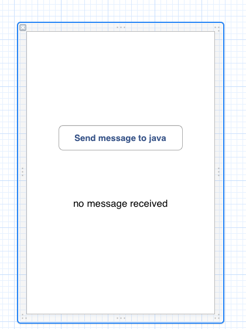

## Using Java in Stella SDK

### At a glance

While Stella SDK is an Objective-C framework, Android development features many third-party APIs that are Java-based. Stella SDK Pro offers a JNIHelper class that provides a means of two-way communication between Objective-C and Java. This allows Objective-C developers to leverage third-party APIs in their apps quickly.

### JNIHelper architecture

#### Multi-threaded architecture

Apps made with Stella SDK utilises Android NDK’s Activity class to achieve high performance. Android OS launches the apps in its Java virtual machine thread (the “__JVM thread__”) after which Stella SDK spawns a separate thread (the “__Stella thread__”) for applications. The entry point of Stella thread is the main () function:

    int main (int argc, char * argv[])
    {
            UIApplicationMain (argc, argv, nil, nil);
    }

Understanding the separation between the __JVM thread__ and __Stella thread__ is critical when integrating Java functions in Stella Apps. In principal, native events and drawings (Objective-C) shall always happen in Stella thread and Java function calls shall always happen in JVM thread. The JNIHelper smooths the communication between native and Java functions.

Conceptually the communication can be both ways. Suppose the native side initiates an action, the sequence of events are described as follows:

| Stella thread                    | JVM thread
| -                                | -
| native: initiate call to Java    |
| Java: run command on UI thread   |
|                                  | Java: command run on UI thread
|                                  | Java: native callback
|                                  | native: forward callback to stella thread
| native: action performed         |

#### Using JNIHelper

The guide below demonstrates how to use JNIHelper to implement two-way communication between Objective-C and Java.

Starting with xcgen, we could generate an Android xcodeproj:

    $ mkdir $HOME/Features; cd $HOME/Features
    $ xcgen --project Features --target android --new
    $ open Features-android.xcodeproj

Now, in Xcode, open MainWindow.xib, and add a button and message label to it. Pressing the button sends a message to Java, which then calls back a messsage to be displayed on the label:

When the button is pressed, a message is initated in __Stella thread__ to Java on the native side in `-[AppDelegate sendMessageToJava]`:

    #if defined (__STELLA_VERSION_MAX_ALLOWED) && defined (__ANDROID__)
        [[JNIHelper sharedHelper] sendMessageToJava];
    #endif

JNIHelper is a singleton object which calls `MainHActivity::sendMessage` Java method:

    (*self.env)->CallStaticObjectMethod (self.env, classID_MainHActivity, methodID_sendMessage);

When Java receives the message, it performs callback to native on the `sendMessage` method in the __JVM thread__:

     _sharedMainHActivity.runOnUiThread (new Runnable () {
             @Override
             public void run () {
                     nativeCallbackMessage (message);
             }
     });

callback is then caught on native side in `MainHActivity_nativeCallbackMessage` method, which forwards it to be processed again in __Stella thread__:

    [[JNIHelper sharedHelper] performSelectorOnMainThread: @selector(callbackMessage:) withObject: message waitUntilDone: NO];

Finally such call back is forward again to `-[AppDelegate receivedMessageFromJava:]' which updates the message label:

    _messageLabel.text      = message;

### Complete sample

A complete sample can be found at in Stella SDK Features test, which can be installed on Android device:

    $ stella-config --switch=es1
    $ cd /opt/StellaSDK/samples/Features/Resource/en.lproj
    $ sibtool -x MainWindow.xib
    
    $ cd /opt/StellaSDK/samples/Features
    $ xcgen --project Features --target android --es1
    $ open Features-android.xcodeproj

After building in xcodeproj, install the test on Android:
    
    $ cd Features-android
    $ stella-config --fix-assets
    $ android update project -p . -s --target android-10 --name Features
    $ ndk-build
    $ ant clean; ant debug install

### Revision history

Revision    | Notes
-           | -
20120911    | Initial revision
20130822    | Changes for Stella SDK II

