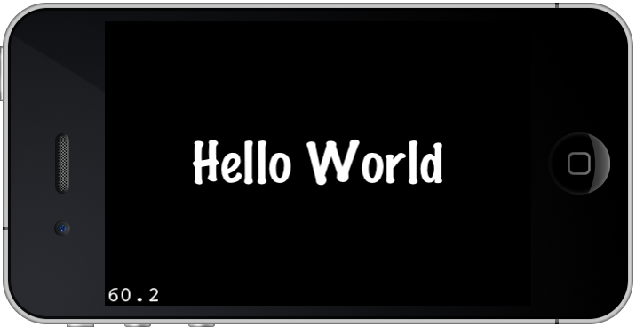
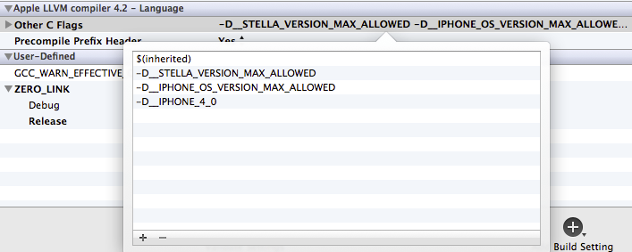
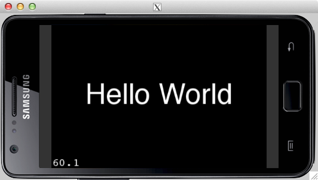

## Using Cocos2D with Stella SDK

### About Cocos2D

Cocos2D is a popular 2D game engine on iOS. Stella SDK allows the Objective-C version of cocos2d to run on Android. There are two versions of Cocos2D available, v1 and v2. The main difference is that Cocos2D-v2 uses OpenGLESv2 and therefore can use shaders.

This tutorial covers the basics of setting up a Cocos2D project with Stella SDK for both v1 and v2.

### Creating HelloWorld with Cocos2D

#### Creating an Cocos2D iOS project

With Stella SDK a template Cocos2D projects can be created very easily. To create a Cocos2Dv1Test sample project with Cocos2Dv1, specify v1 as an argument::

    $ cd $HOME/Desktop
    $ stella-config --setup-cocos2dv1-template=Cocos2Dv1Test
    $ open Cocos2Dv1Test/Cocos2Dv1Test.xcodeproj

After hitting Run, the iOS simulator will be launched:

#### Converting the project to run on Android

With xcgen, the iOS cocos2d project can be converted to Android simulator and device. First off, test the project with the Android simulator:

    $ cd $HOME/Desktop/Cocos2Dv1Test
    $ xcgen --project Cocos2Dv1Test --target mac --es1
    $ open Cocos2Dv1Test-mac.xcodeproj

Cocos2Dv1 requires OpenGLESv1 to be enabled in Stella SDK:

    $ stella-config --switch=es1

Cocos2Dv1 uses -D__IPHONE_OS_VERSION_MAX_ALLOWED and -D__IPHONE_4_0 compiler flag to determine the platform. Add such a flag to the Other C Flags build settings:

After hitting run, the Stella Android simulator will be launched. Press 'R' or 'L' to rotate the screen clockwise or counter-clockwise:

To build for Android devices, xcgen and build:

    $ cd $HOME/Desktop/Cocos2Dv1Test
    $ xcgen --project Cocos2Dv1Test --target android --es1
    $ open Cocos2Dv1Test-android.xcodeproj

Add -D__IPHONE_OS_VERSION_MAX_ALLOWED and -D__IPHONE_4_0 to Other C Flags.

Plug in your android device, and install the apk:

    $ cd $HOME/Desktop/Cocos2Dv1Test/HelloWorldSample-android
    $ stella-config --fix-assets
    $ android update project -p . -s --target 10 --name HelloWorldSample
    $ ndk-build
    $ ant clean; ant debug install

Similar steps go for Cocos2Dv2, except that:

* use --setup-cocos2dv2-template to create project
* -D__IPHONE_OS_VERSION_MAX_ALLOWED and -D__IPHONE_4_0 flags are not necessary
* --es2 flag is used during xcgen
* --switch=es2 flag is used during stella-config
* use HelloWorld rather than HelloWorldSample as the product name

### Revision history

Revision    | Notes
-           | -
20130730    | Initial revision

